# 优化方案与改动面

> 前置：`00-discussion.md`、`01-problem-analysis-and-current-state.md`
> 作用：后续实施会话的执行契约；本文件冻结目标架构、数据/API 语义、阶段、文件改动面、兼容与回滚。
> 约束：保持 Next.js + SQLite 模块化单体，不引入外部队列、微服务或无法证明的 Provider exactly-once。

## 1. 方案总览

本批采用“**幂等接纳 + SQLite 持久化生命周期 + 进程内可恢复推进**”方案：浏览器先给一次用户意图生成稳定 `clientRequestId`；API 在单个 transaction 中完成去重、Generation/Jobs、每 Job 请求快照和 Session touch，随后立即返回 `202`。Provider submit、poll、图片转存和远端取消不再绑定 POST 响应，而由同一 job-engine 通过可租约的 phase 推进；进程退出后，worker 或 Stage detail GET 从 SQLite 继续。

```mermaid
flowchart LR
    UI["Generate / sessionStorage intent"] -->|"clientRequestId + payload"| API["POST /api/generations"]
    API --> CHECK["readiness + validate + canonical hash"]
    CHECK --> TX["SQLite transaction: dedupe + Generation + N Jobs + snapshots + touch Session"]
    TX -->|"202 + Generation ID"| UI
    TX --> DUE["durable phase = queued"]
    DUE --> ADV["worker / Stage GET: claim lease and advance"]
    ADV --> PROVIDER["Provider adapter"]
    PROVIDER -->|"async handle"| POLL["phase = polling"]
    PROVIDER -->|"sync image refs"| STORE["phase = storing"]
    POLL -->|"completed image refs"| STORE
    STORE --> SAFE["bounded, validated image ingestion"]
    SAFE --> TERM["terminal Job + aggregate Generation"]
    PROVIDER -->|"outcome unknown"| UNKNOWN["failed + PROVIDER_OUTCOME_UNKNOWN; no blind replay"]
```



该方案提供三层不同的幂等语义：

1. **API 接纳幂等**：同一 `clientRequestId` + 同一 payload 永远返回同一 Generation。
2. **Provider dispatch 安全**：只有 Provider 明确未受理，或该 Provider 已验证支持同键幂等，才允许自动重投；其余超时/断线进入结果未知。
3. **图片转存幂等**：`(jobId,index)` 唯一键、可恢复 result snapshot、文件清理和终态 CAS 共同防重复与残留。

## 2. 设计决策表

| 决策项 | 采用方案 | 选择理由 | 放弃的方案 | 代价/已知债务 | 追踪 |
|---|---|---|---|---|---|
| 系统形态 | 现有模块化单体 + SQLite durable job | 当前规模、部署和团队边界均为单机 MVP；问题可在单库内解决 | Redis/BullMQ、Kafka、微服务 | 单进程吞吐和多实例协调不是本批目标 | P-04/P-08 |
| schema 版本 | `PRAGMA user_version` + required-schema manifest 双检 | user_version 负责顺序，manifest 防止“版本数字正确但列/索引缺失” | 只 `SELECT 1`；只信 Drizzle schema；完整迁移平台 | manifest 需随 migration/schema 同步，并由测试守门 | P-01/P-14 |
| 启动策略 | `dev/start` 前自动执行幂等 migration；运行时 readiness 再校验 | 本地单机优先恢复可用；即使绕过 npm script，也不能错误接单 | 只写 README 要求人工迁移；请求时临时补列 | migration 必须可重复、先备份、失败即阻断启动 | P-01 |
| health 语义 | `/api/health` 为 readiness；新增 `/api/health/live` 为 liveness | 浏览器/部署方需要知道是否可服务，而非仅进程存活 | 继续混合一个模糊 `ok` | 多一个小 route 和 DTO | P-01 |
| POST 成功语义 | durable admission 后 `202 Accepted` + `Location` | 外部工作尚未完成；尽快把可恢复 ID 交给浏览器 | 等全部 submit/同步下载后 `201` | 内部客户端和 contract 需同步更新 | P-03/P-04 |
| 接纳幂等 | body `clientRequestId` 为必填 UUID；可选 `Idempotency-Key` 必须与 body 相同 | body 便于类型和 sessionStorage；header 兼容标准调用方 | 仅客户端双击锁；服务端随机 ID | 对旧调用方是受控 breaking change | P-03 |
| payload 冲突 | canonical JSON 的 SHA-256；同键异 payload 返回 409 | 防止错误复用同一意图身份 | 相同 key 总是静默返回旧任务 | 需维护稳定 canonicalizer | P-03 |
| 请求快照 | 每个 Job 持久化版本化、已校验的 `NormalizedRequest` | Provider 能力裁剪后才是真实派发输入，进程重启可恢复 | 只保存整单原始 body；从现有 prompt/model 猜参数 | SQLite 会短期保存 reference input；终态时清除快照 | P-04 |
| 生命周期 | 保留 5 个用户状态，另加内部 `phase` | 避免把 dispatch/storage/cancel 运维细节扩散到 History/Gallery，同时可恢复 | 给 public status 增加十多个状态；继续用一个 pending | public `failed + PROVIDER_OUTCOME_UNKNOWN` 需 UI 特判 | P-04/P-08 |
| Provider submit 重试 | 排队/网络发送前失败为 `not_started`，或 Provider 明确拒绝时才有界重试；发送后结果未知不重试 | 优先防重复费用；`retryable` 不能等同于“可以重放副作用” | timeout/5xx 通用 retry(3)；从不区分是否已发送 | 已开始 HTTP 后但实际未受理的极少数请求会被保守标记 unknown | P-03/P-06 |
| poll/download 重试 | bounded exponential backoff + jitter + Retry-After + elapsed budget | 读取/下载可幂等，适合跨过瞬时故障 | 单次失败终结；无限重试 | 状态与测试增多 | P-06 |
| cancel | 本地立即进入 `cancelled`，内部 phase 可继续 `cancelling`；远端尽力、有界恢复 | 用户不被远端取消接口拖住；崩溃后仍会收口远端动作 | marker 后同步等全部远端结果；忽略远端 cancel | 本地 cancelled 不承诺远端绝对停止/不计费 | P-05 |
| worker | 默认启用（显式 `JOB_WORKER_ENABLED=false` 才关闭），detail GET 仍可辅助推进 | 单机无需外部队列即可恢复；关闭 worker 时仍保留 lazy path | worker 默认关闭；新增独立服务 | 进程未被任何请求/探针唤醒前不会运行 | P-04/P-08 |
| 图片边界 | 协议/地址/redirect/大小/type/magic byte 全部验证；Base64 先有界暂存；敏感 URL 脱敏 | Provider URL/body 是不可信输入，且可能含签名或大体积内联图片 | 直接 `fetch(url).arrayBuffer()`；把 data URL 写进 SQLite | native fetch 的 DNS 预检存在 TOCTOU 残余；MVP 明确接受，不能宣称完全阻断 DNS rebinding | P-09/P-10 |
| 前端恢复 | submission intent 写 sessionStorage；Stage 与 Compose bootstrap 解耦 | 响应丢失/刷新后可用同 key 找回；已知 ID 不受配置列表故障影响 | 只保留 React state | 需要过期和 payload-hash 清理规则 | P-02/P-03/P-11 |
| 默认 fan-out | 默认仅选择 1 个已启用模型；多选时展示调用数/预计图片数 | 降低无意成本且不增加首次使用摩擦 | 默认 0 个；默认最多 8 个 | 用户要主动增加多 Provider 比较 | P-12 |
| Seed 语义 | 只有所有 targets 支持时可用；服务端也拒绝部分生效 | 共享参数必须具有可预测含义 | 继续 `some` 并静默裁剪 | 原有“部分 Provider 应用 seed”行为被收紧 | P-12 |
| E2E | 真实 Next HTTP + 本地 fake Provider；另加最小 Playwright 浏览器流 | 用户明确要求 E2E，现有空命令不能充当验证 | 只 import route；只人工点页面 | 新增测试依赖、进程编排和少量运行时成本 | P-14 |

### 2.1 不可逆/高成本决策说明

- schema 改动只做 additive columns/indexes；不会在本批 drop 旧列。数据库升级后不执行 down migration，代码回滚依赖“旧代码忽略新增列”。
- `client_request_id` 唯一性是数据契约。一旦产生真实任务，不允许通过删除唯一索引解决冲突；应修正 canonicalization 或调用方 key 生命周期。
- Provider 远端副作用无法由本地 SQLite 事务回滚。本批明确承诺的是“本地去重 + 不盲重投 + 结果未知可见”，不是远端 exactly-once。

## 3. 核心数据与状态设计

### 3.1 Generation 新增字段

| 字段 | 约束 | 语义 |
|---|---|---|
| `client_request_id` | 旧行可 NULL；新接纳 NOT NULL；partial unique index | 浏览器用户意图的稳定身份 |
| `request_hash` | 旧行可 NULL；新接纳 64 位 SHA-256 hex | canonical payload 指纹；判断同 key 是否同一请求 |

唯一索引：`UNIQUE(client_request_id) WHERE client_request_id IS NOT NULL`。当前是单用户应用，不把 Session/Project 加进唯一键，避免同一浏览器意图因路由状态变化生成两单。

### 3.2 Generation Job 新增字段

| 字段 | 语义 |
|---|---|
| `phase` | `queued / dispatching / polling / storing / cancelling / terminal / outcome_unknown` |
| `request_snapshot` | 版本化 `NormalizedRequest` JSON；只允许 validated fields，不包含 secret |
| `request_snapshot_version` | 初版固定 `1`，未知版本禁止派发 |
| `result_snapshot` | 有界远端 URL 或 opaque staging-file refs 的短期恢复快照；禁止 data URL/Base64；完成/终结后清空，不进入 API/log |
| `attempt_count` | 当前 phase 的连续失败/派发次数；phase 成功切换时归零 |
| `retry_started_at` | 当前连续 retry window 起点，用于 elapsed budget |

现有物理列 `poll_lease_until` 和 `next_poll_at` 在 improve-1 内继续保留，为避免 SQLite rebuild 不做 rename；其运行时语义扩展为“**当前 phase 的 lease**”与“**当前 phase 的下一次 due 时间**”。TypeScript helper 和新文档使用 `lease` / `nextAttempt` 术语，DB 文档明确物理兼容映射。若未来引入独立 worker/多实例，再以单独 migration 正式重命名。

新增 due index 至少覆盖 `phase, next_poll_at, poll_lease_until, updated_at`，防止 worker 无序全扫。

### 3.3 请求与结果快照约束

- request snapshot 在全量校验、prompt process、按 Provider capability 裁剪之后生成，每个 target 各一份。
- 只允许 `prompt/mode/width/height/aspectRatio/count/negativePrompt/seed/referenceImages/providerOptions`；不允许 session、provider credential、任意内部对象或函数透传。
- JSON 写入前执行深度、key 数、字符串和总字节上限；整个 POST body 也设置上限，避免 reference data URL 撑爆内存/SQLite。
- result snapshot 只在 Provider 已返回 image refs、尚未完成本地转存时存在；只保存有界远端 URL 或服务端生成的 opaque staging ref，终态 transaction 中清空。
- ZenMux 若返回 Base64/data URL，必须先经流式/分块解码、25 MiB 硬上限、类型与 magic-byte 校验写入私有 staging 临时文件，再把 opaque ref 写入 snapshot；不得把原 data URL 写入 SQLite。Doubao 及其他 adapter 即使当前通常返回 URL，也必须走同一防御分支处理意外 Base64。**D1 已提供 25 MiB、content-type 一致性和不透明 `staging:<uuid>` 引用的最小私有 staging，保证当前 ZenMux 正常可用且 raw Base64 不入库；E3 再补流式解码、magic-byte、总预算和完整清理策略。**
- server log、API DTO 和 UI 不输出两个 snapshot；错误只输出安全 code 与 redacted context。

### 3.4 旧数据回填

| 旧 Job 情况 | backfill |
|---|---|
| status 为 `completed/failed/cancelled` | `phase=terminal` |
| active 且 `cancel_requested_at IS NOT NULL` | 保持用户 status=`cancelled`；有 handle 时 `phase=cancelling`，无 handle 时 `phase=terminal`；不得回到 polling |
| active 且 `provider_handle IS NOT NULL` | `phase=polling`；可继续现有 handle |
| active 且 handle 为空 | `status=failed`、`phase=outcome_unknown`、error=`LEGACY_DISPATCH_STATE_UNKNOWN`；不猜测重投 |

旧行没有 request snapshot，但 terminal 不需要恢复；已有 handle 的 polling 只需要 handle。迁移输出 backfill 数量，便于人工检查。

### 3.5 内部 phase 与用户状态

| phase | 用户 status | 可进入 | 可离开到 |
|---|---|---|---|
| `queued` | pending | admission；明确未受理且可重试 | dispatching、cancelling |
| `dispatching` | pending | 成功 claim queued lease | queued、polling、storing、cancelling、terminal、outcome_unknown |
| `polling` | pending/running | async handle 已持久化 | polling、storing、cancelling、terminal |
| `storing` | running | result snapshot 已持久化 | storing、cancelling、terminal |
| `cancelling` | cancelled | 本地取消 transaction 已完成 | cancelling、terminal |
| `terminal` | completed/failed/cancelled | lifecycle 正常收口 | 不可离开 |
| `outcome_unknown` | failed | submit 结果不确定或 legacy 无法恢复 | 不可自动离开 |

额外规则：

1. user status 终态不可逆；`running` 后 Provider 若回报 pending，仍保持 running。
2. `completed` 必须至少有一张已验证且可读取的 image；空结果不能 completed。
3. result 少于请求 count 时允许保留有效图片并 completed，但记录安全 warning `PROVIDER_PARTIAL_RESULT`；多于 count 只接受前 `count` 张并记录 warning，避免无界转存。
4. `outcome_unknown` 使用稳定错误 `PROVIDER_OUTCOME_UNKNOWN`；UI 显示“远端可能已受理，请勿直接重复新建”，而不是普通失败。
5. Generation 聚合仍按 active 优先；无 active 时“任一 completed → completed，否则 cancelled/failed”。页面继续派生 partial 展示，unknown job 作为独立警告呈现。

## 4. API 与错误契约

### 4.1 POST `/api/generations`

请求新增：

```json
{
  "clientRequestId": "15a6fecc-4f40-4ed2-8f51-353423be9af1",
  "sessionId": "...",
  "prompt": "...",
  "targets": [{ "provider": "fal", "model": "..." }]
}
```

- `clientRequestId` 必填并校验 UUID；`Idempotency-Key` header 可省略，若提供则必须完全相同。
- canonical hash 排除 `clientRequestId`，保留 targets 顺序，object key 稳定排序，`undefined` 规范为省略、`null` 保留。
- 新请求与同键同 payload 重放都返回 `202`；并发 insert loser 重新查询唯一键，不创建第二条。
- 同键异 payload 返回 `409 IDEMPOTENCY_KEY_REUSED`。
- 响应：

```json
{
  "id": "generation-id",
  "status": "pending",
  "replayed": false,
  "links": { "self": "/api/generations/generation-id" }
}
```

同时设置 `Location`、`X-Request-Id`；重放时 `replayed=true`。API 返回前只要求 durable admission 成功，不等待任何 Provider 或图片下载。

### 4.2 统一错误 envelope

Generation POST/detail/cancel、health readiness 至少统一到：

```json
{
  "error": {
    "code": "SCHEMA_NOT_READY",
    "message": "Database schema is not ready",
    "retryable": false,
    "requestId": "server-correlation-id"
  }
}
```

- 所有响应含 `X-Request-Id`；只接受符合长度/字符约束的入站 request ID，否则服务端重建。
- `message` 是安全英文 fallback，不含 secret、完整 prompt、snapshot、Provider raw body 或带 query URL。
- `details` 只允许白名单字段（如 validation field、required/current schema version），不得透传任意 exception。
- `retryable` 表示“按该 HTTP 操作契约重试可能成功”；对 POST 必须复用同一 `clientRequestId`，不表示可创建一条新任务。

本批稳定 codes：

| 类别 | codes |
|---|---|
| readiness | `SCHEMA_NOT_READY`, `DATABASE_UNAVAILABLE` |
| request | `INVALID_JSON`, `PAYLOAD_TOO_LARGE`, `VALIDATION_ERROR`, `IDEMPOTENCY_KEY_REUSED` |
| auth/config | `AUTHENTICATION_REQUIRED`, `CONFIGURATION_UNAVAILABLE`, `CREDENTIAL_MANAGED_BY_ENV` |
| admission | `RATE_LIMITED`, `QUEUE_SATURATED` |
| resource | `NOT_FOUND`, `GENERATION_FINALIZING` |
| job diagnostics | `PROVIDER_REJECTED`, `PROVIDER_RATE_LIMITED`, `PROVIDER_TIMEOUT`, `PROVIDER_OUTCOME_UNKNOWN`, `RETRY_EXHAUSTED`, `PROVIDER_EMPTY_RESULT`, `PROVIDER_PARTIAL_RESULT`, `STORAGE_RESPONSE_INVALID`, `CANCEL_UNSUPPORTED`, `CANCEL_UNCONFIRMED` |
| internal | `INTERNAL_ERROR` |

Job diagnostics 出现在 Generation view 与 History/read-model 的 job.error，但必须经过同一 safe mapper；API error 与 job error 共用 code registry，不共用任意原始 message。

### 4.3 Health

- `GET /api/health/live`：只证明 Node route 可响应，固定 200 `{ status: "ok" }`，不启动 worker、不访问 Provider。
- `GET /api/health`：执行 DB connect + `user_version` + required manifest + foreign-key 配置检查；兼容时 200，schema 缺失时 503 `SCHEMA_NOT_READY`，DB 不可用时 503 `DATABASE_UNAVAILABLE`。
- ready 后才允许启动 worker。health 不主动调用真实 Provider，只返回当前 enabled provider IDs。

## 5. 任务推进、重试与取消

### 5.1 Durable admission transaction

同一 transaction 内依次完成：

1. 按 `clientRequestId` 查询/校验 replay；
2. 创建 Generation；
3. 创建 N 个 `phase=queued` Jobs 和每 Job snapshot；
4. touch Session；
5. commit。

任何一步失败全部回滚。Provider 调用、文件系统写入和日志不得进入该 transaction。

### 5.2 Advance 规则

- worker 和 detail GET 只调用同一个 `advance(job)`；不得各自复制状态逻辑。
- `claimDueJob()` 使用 phase、due time、lease expiry 的单条条件 UPDATE；claim 不改变用户 status。
- lease token 仍使用写入的 expiry 值做 CAS；所有外部结果写回都要验证 lease 与 cancel marker。
- `listDueGenerationJobs()` 排除有效 lease，按逻辑 `nextAttempt/updatedAt/id`（物理列仍为 `next_poll_at/updated_at/id`）稳定排序后再 limit，避免 batch 饥饿。
- `storing` 每次 lease 最多处理一张尚缺失的 image；每张成功后持久化 row/file，再释放或短 due 重新排队处理下一张，避免多图任务跨过 lease budget。
- worker 统计领域结果：`advanced/retried/completed/failed/unknown/cancelled/skipped`，不能再把 Promise fulfilled 等同业务成功。

### 5.3 重试矩阵

统一 full-jitter：`delay = random(250ms, min(cap, base * 2^(attempt-1)))`；若存在合法 `Retry-After`，采用不小于该值但不突破 operation elapsed budget 的时间。

| 操作 | 可重试条件 | 最大总 attempt | base/cap | elapsed budget | 不重试条件 |
|---|---|---:|---|---|---|
| Provider submit | limiter 排队超时/abort、HTTP 尚未开始发送即失败（`not_started`），或明确可重试的 Provider 拒绝（`rejected`） | 3 | 1s / 15s | 30s | HTTP 已开始后的 timeout/reset、未知 5xx、已可能受理（均 `unknown`） |
| Provider poll | 429、timeout、network、5xx | 连续 6 | 2s / 60s | 首次失败后 10min | 4xx 业务失败、handle invalid；成功 poll 重置计数 |
| Provider cancel | 429、timeout、network、5xx，且有 cancel endpoint/handle | 3 | 1s / 10s | 30s | unsupported；本地 cancelled 不回退 |
| image download | 429、timeout、network、5xx、短读 | 3 | 500ms / 5s | 每张 60s | 非图片、超限、私网、非法 redirect、4xx（429 除外） |
| browser POST | network/timeout/429/5xx；始终同 key | 2 | 500ms / 2s | 30s | 4xx 非 retryable、payload conflict |
| browser detail GET | network/timeout/429/5xx | 连续 6 后暂停 | 2s / 30s | 单次 12s | 404/401/非 retryable；用户可手动恢复 |

Provider adapter 的 submit error 新增副作用判定 `disposition: not_started | rejected | unknown`：

- limiter 队列超时/取消、queue saturation，以及 transport 能证明 HTTP 尚未开始发送的失败为 `not_started`，可在预算内安全重排。
- 429 与明确 validation/auth response 为 `rejected`；其中只有 retryable rejected 可自动重试。
- HTTP 已开始发送后的 timeout、connection reset、网络中断和不能证明未受理的 5xx 为 `unknown`，即使底层异常标记 retryable 也不得自动重投 submit。
- fal、ZenMux、SiliconFlow、Zhipu、Doubao、Qwen、Kling 在 improve-1 默认都**不声明 Provider submit idempotency**；后续只有官方契约和 adapter test 同时证明后才能打开 unknown replay。
- poll 是读取型操作，按上表有界重试；`retryable` 不再被 catch 强制覆写为 false。

### 5.4 Dispatch 崩溃窗口

1. `queued` claim 成 `dispatching`，立即持久化 lease，再调用 Provider。
2. Provider 返回 async handle 时，在同一 DB write 中保存 handle、切 `polling`、清 dispatch lease；若本地取消已在 dispatch 期间获胜，则以原 dispatch lease + cancelling marker CAS 持久化该 handle，保持 `cancelling` 以便 worker 做远端取消，绝不复活公开 status。
3. Provider 返回 sync refs 时，D1 对 URL 直接持久化有界 ref；对 Base64/data URL 先写入带 25 MiB 上限的私有 staging，只把不透明 `staging:<uuid>` 写入 `result_snapshot`，切 `storing`、清 dispatch lease，之后再开始落正式图片；E3 在此基础上补流式解码、magic-byte、总预算和完整远端图片安全策略。
4. 进程若在 `dispatching` lease 过期后仍无持久结果：
   - Provider 支持且实际使用相同 idempotency key：可按策略恢复；
   - 本批七家默认不满足，切 `outcome_unknown`，不重投。
5. 进程若在 `storing` 退出，result snapshot 允许按“一次 lease 一张缺失 image”继续；已存在 index 不重写。

这会保守地产生极少量“可能没真正发出但被标为 unknown”的任务，代价小于重复费用和不可见远端任务。

### 5.5 取消

- cancel API 在一个 transaction 中批量把所有可取消 Job 的用户 status 置为 `cancelled`、写 `cancel_requested_at`、phase 置 `cancelling` 并重聚合 Generation；queued 且从未 claim 的 Job 可直接 `terminal`，避免 fan-out 半取消。
- API 立即返回聚合视图，不等待远端。
- worker 对有 handle/支持 cancel 的 Job 执行有界重试；unsupported 或预算耗尽均写安全 warning 后 terminal。
- dispatch/poll/store 每个外部调用前后都检查 cancel marker；dispatch 在 limiter 队列真正执行前重新读取 lease/marker，晚到结果不能恢复 user status。
- storing 的「文件已下载 → DB row/phase」在同一短 SQLite transaction 内用 lease + `cancel_requested_at IS NULL` 条件提交；取消先线性化时没有 image row 可见且立即删除文件，存储 checkpoint 先线性化时保留该次已提交图片、停止后续图片。补偿失败记录 structured log 并由现有 orphan cleanup 兜底。

## 6. Provider、限流与图片安全边界

### 6.1 Provider HTTP

- `http-client.ts` 接受 caller signal/deadline；submit 30s、poll 15s、cancel 10s 为默认上限，可按 adapter 更短，不能更长于 caller remaining budget。
- 普通 Provider JSON response 必须流式计数并设置默认 2 MiB 硬上限（adapter 只能设得更小）；明确允许 Base64 的 endpoint 不得调用无界 `response.json()`，而应走专用流式 staging parser，并同时受“每张解码后 25 MiB、请求 count 对应总预算、编码 envelope 总上限”约束。任一上限触发即 abort，错误只保留有界、脱敏摘要。
- 解析并上限化 `Retry-After`；错误保留 status/code/retryable/disposition/retryAfterMs，不保留 raw credential 或完整 body。
- `withProviderLimit()` 增加 queue 上限（默认 32/provider）、排队 deadline（默认 30s）和 AbortSignal；队列满快速返回 `QUEUE_SATURATED`。
- 不同 Provider 继续独立 bucket，避免一家慢拖住其他 targets。
- 所有携带 Authorization 的 Provider 请求使用 manual redirect；跨 origin redirect 一律拒绝，既不继续请求也不转发 credential。
- Fal 返回的动态 status/response/cancel URL 必须与配置的 Fal API origin（scheme、host、effective port）精确一致；Provider API redirect 不跟随，因此没有携带 credential 的第二跳。
- Qwen/Kling 的 legacy handle URL 只作兼容字段保存；poll URL 必须由受信 base URL + 编码后的 external ID 重建，不执行 Provider response 或 DB 中的任意完整 URL。
- 可配置 base 只接受无 userinfo/query/fragment 的 HTTP(S) URL；所有动态 path segment 有长度上限，并拒绝空、`.`、`..`，防止 WHATWG URL 规范化逃出 API path 前缀。

### 6.2 远端图片 ingestion

- 允许 `data:`（仅 base64 raster image）和 `https:`；`http:` 仅测试或显式本地开发开关，生产默认拒绝。
- HTTP redirect 使用 manual 模式，最多 3 次；每一跳重新校验 scheme、DNS 解析结果和 host。
- 拒绝 loopback、RFC1918、link-local、multicast、metadata endpoint、IPv4-mapped IPv6 等非公网地址；连接/每次 redirect 前做 DNS/IP 预检只能降低风险。native fetch 可能在预检后自行再次解析，存在 DNS TOCTOU/rebinding 残余；MVP 明确接受该残余，不宣称已完全解决，若安全边界升级则改用能 pin 已校验地址的自定义 Node transport。
- 先检查 `Content-Length`，再以流式计数强制每张最大 25 MiB；不再无界 `arrayBuffer()`。
- data URL/Base64 同样受 25 MiB **解码后**硬上限，先校验后写私有 staging 文件；snapshot 只保存 opaque ref，取消、终态、过期或失败时清理 staging 文件。
- 仅接收 PNG/JPEG/WebP，Content-Type 与 magic bytes 必须相符；GIF/SVG/HTML/JSON/空 body 拒绝。
- error/log 中 URL 只保留 origin + 完整 URL 的不可逆 digest，不记录 pathname、query 或 fragment；data URL 既不记录也不参与可逆摘要。
- 文件先写临时路径，校验后原子 rename；DB unique insert 失败清理 loser file；终态/取消 CAS 失败执行 attempt-scoped cleanup。

## 7. 前端恢复与交互语义

### 7.1 Submission intent

- 用户点击时对 canonical payload 计算浏览器 hash，并在 `sessionStorage` 保存 `{ clientRequestId, payloadHash, createdAt }`。
- 同 payload 在未得到 definitive response 前复用 key；任一实际输入变化产生新意图和新 key。
- 成功拿到 Generation ID 后写入 URL 并清理 pending intent；若响应丢失，重放同 key由服务端返回原 ID。
- intent 默认 24 小时过期；project/session 不匹配时不复用。
- React submit ref/sequence 继续保留，承担 UX 防双击；服务端唯一约束才是正确性边界。

### 7.2 错误反馈

- Generate 不再 `catch {}`；保留 `ApiClientError` 并通过 `code → i18n key + action` 映射。
- 至少区分：输入问题、Provider 未配置/凭据、限流等待、服务未 ready、网络结果未知、同 key payload 冲突、内部错误。
- 用户文案不展示 raw Provider message；可显示短 request ID 供排查。
- 只有幂等重放按钮复用原 key；“新建一次生成”必须明确创建新 key，避免两个动作混淆。

### 7.3 Stage 与轮询

- URL 已有 `generation` 时，Stage shell 和 detail request 立即启动；Sessions/Providers/Preferences 失败只影响返回 Compose 后的配置，不阻塞当前任务。
- 每个 GET 有 12s deadline；unsubscribe、route change 和组件 unmount 真正 abort 网络请求。
- retry 使用 jitter；`navigator.onLine=false` 或页面 hidden 时暂停定时请求，恢复后先进行一次带抖动的 GET。
- 连续 6 次**浏览器 detail 请求** transient failure 后停止客户端自动轮询，展示最后成功快照、错误类别和手动“继续检查”；这不改变服务端 Job 的真实状态。Provider poll 的 D2 预算耗尽则明确写 `failed + RETRY_EXHAUSTED`。
- 若 Job 为 `PROVIDER_OUTCOME_UNKNOWN`，Stage 提醒远端可能仍运行，不提供无提示的“自动再生成”。

### 7.4 fan-out 与参数

- 初始化只选择第一个已启用模型；用户可主动多选，保留最多 8 targets。
- Generate 明示“将调用 N 个模型 / 最多生成 M 张”；取消不了的 Provider 也在提交前可见。
- Seed 与其他共享参数使用 capabilities 交集；服务端保持同样校验，前端状态不能绕过。

## 8. 分阶段实施与 commit 边界

每一批都必须可 typecheck、通过直接相关测试并独立 commit。已有 Gallery/locale switcher 脏工作树不属于本计划，不得 stage。

### Batch 0 — 规划文档

**建议 commit**：`docs: plan generation pipeline resilience`

- 新增本目录 README、00、01、02、04。
- 不修改业务代码。
- DoD：文档自检通过；P-01…P-14 均可追踪；只 stage 本 problem-list。

### Batch A — 当前数据库恢复与 readiness

**建议 commit**：`fix(db): gate generation on compatible schema`

- 重构 `scripts/migrate-db.mjs` 为有序、幂等 migration；设置 `user_version`，迁移前创建一次版本化 backup，结束后验证 manifest/foreign keys。
- 新增 schema compatibility checker 与 manifest；`/api/health` 改 readiness，新增 live route。
- `predev/prestart` 执行 migrate；Generation POST 在 schema 不 ready 时快速返回 503。
- 本批只冻结 readiness status/code/details；`X-Request-Id` 与 correlation contract 由 Batch B 增加，避免 A 的测试提前依赖 B。
- DoD：触发截图故障的旧 schema 副本可升级且保留数据；未迁移副本 health/POST 均拒绝；当前真实 `data/app.db` 经备份后迁移可生成到 Provider dispatch 前。
- 对应：P-01、P-14。

### Batch B — 结构化错误、correlation 与 i18n

**建议 commit**：`feat(api): add actionable generation errors`

- Generation/health 使用统一 error envelope、request ID、安全 logger/redaction。
- ApiClientError 支持 requestId/retryAfter；Generate 映射中英文 code 与动作。
- 暂不增加自动 POST retry。
- DoD：schema/config/validation/rate-limit/internal 五类错误有 contract + component/unit 断言，UI 不再统一显示 `generate.submitError`。
- 对应：P-02、P-13。

### Batch C — 接纳幂等

**建议 commit**：`feat(generation): make admission idempotent`

- migration 增加 Generation client key/hash/index；canonicalizer 与原子 create-or-replay。
- Web Client/Generate 生成并复用 intent；同键异 payload 409。
- 该批可暂时保持现有同步 dispatch，以缩小变更；API client 同时接受 201/202，最终语义在 Batch D 切为 202。
- DoD：重复/并发/响应重放只存在一个 Generation；payload conflict 可诊断；旧 rows 兼容。
- 对应：P-03。

### Batch D — 持久化 phase 与可恢复推进

**建议拆为两个 commit**：

1. `feat(job-engine): persist recoverable dispatch state`
2. `fix(job-engine): recover retry cancel and storage phases`

- migration 增加 Job phase/snapshots/retry state/index并 backfill。
- admission transaction 包含 session touch，POST 切为立即 `202`。
- refactor lifecycle/state transition/worker due scan；默认 worker；dispatch/poll/store/cancel 使用同一 advance。
- result snapshot、状态单调、空结果、图片补偿和领域 worker counters。
- retry state（attempt、elapsed window、next due）在本批持久化；这里只用 typed fake Provider 验证 state transition、重启延续预算与穷尽收口，不在本批宣称真实 HTTP/adapter mapping 已接通。
- DoD：所有 crash checkpoint 在重启后恢复或明确 unknown；无永久无解释 pending；终态不可逆；每个 commit 都有 fault-injection integration。
- 对应：P-04、P-05、P-07、P-08、P-09。

**实施状态（2026-07-20）**：D1 与 D2 已实现、复审并独立验证。D1 覆盖 schema v3/backfill、202 durable admission、版本化 request/result snapshot、phase/lease worker、late-handle cancellation CAS、fan-out 原子取消、lease-guarded image checkpoint、终态快照清理与有界 inline-image staging（raw Base64 不入 SQLite）。D2 新增集中 `retry-policy`：已有 handle 的 typed-retryable poll（最多 6 次/10 分钟）和 remote cancel（最多 3 次/30 秒）以 full jitter、due/lease CAS 与重启延续收口；只有远端 `cancelled` 确认 remote cancel，`pending/running` 重排、`completed` 以安全诊断收口，畸形 runtime result 也写有界 checkpoint。所有新写入的 job 诊断、详情与 History read model 只使用 allowlisted code、固定文案和 retryable 布尔值，绝不暴露 Provider 原始 message/body/prompt/URL；成功/phase 切换/终态/本地取消清空 retry state。E1 已为七家 adapter 的 HTTP error 统一 `not_started / rejected / unknown`、有界 `Retry-After`、caller signal/deadline 和默认 submit/poll/cancel timeout；并为每 provider 的进程内 limiter 增加队列上限、deadline、AbortSignal 移除。只有明确未开始或 retryable rejected 的 submit 可 `dispatching → queued` 有界重排（总计最多 3 次/30 秒）；已进入 fetch 的 timeout/reset/5xx 仍保守进入 unknown。E2 已让所有 Provider JSON 经 2 MiB 流式上限读取，所有带授权请求拒绝自动 redirect；Fal 只接受 exact-origin 动态 handle URL，Qwen/Kling 从 trusted base + encoded external ID 重建 poll URL。单测覆盖超限、redirect 与 URL 污染；远端图片 download/inline Base64 的专用解析仍属于 E3。

### Batch E — Provider、队列与 storage 边界

**建议拆为三个 commit**：

1. `fix(providers): bound http disposition and queues`
2. `fix(providers): constrain adapter urls and responses`
3. `fix(storage): stage and validate remote images`

- E1：Provider HTTP caller deadline、`not_started/rejected/unknown`、Retry-After 与 limiter queue 上限/deadline/abort；已实现。普通 JSON 的 2 MiB streaming reader 归入 E2，避免把 Base64 endpoint 当成普通 JSON 误处理。
- E2：七家 adapter 通过统一 HTTP client 对齐；普通 JSON 2 MiB streaming reader；Fal exact-origin/manual redirect；Qwen/Kling 从 base + external ID 重建 URL；auth redirect 与日志脱敏。**已实现。**
- E3：storage URL/redirect/IP/size/type/magic-byte/temp-file；ZenMux Base64 有界 staging 与 Doubao 防御分支；每 lease 一张缺失 image。
- DoD：真实本地 fake HTTP 串起 I-22… I-25；pre-send 可安全重排，HTTP started unknown 不重投；poll/download transient 按预算恢复；SSRF/超大 JSON/Base64/非图片/签名 URL 测试通过。
- 对应：P-06、P-10、P-13。

### Batch F — Stage 恢复、成本护栏与 E2E

**建议拆为两个 commit**：

1. `feat(web): recover generation submissions and polling`
2. `test(generation): verify resilient flow end to end`

- Stage 解耦、GET deadline/offline/visibility/manual recovery、unknown UI。
- 默认单模型、fan-out 数量提示、Seed capability intersection。
- 新增 backend + browser E2E；同步权威 MVP 文档与测试蓝图。
- DoD：`04` 全部门禁通过，浏览器真实走通 submit → Stage → refresh → completed；子代理审查无未处理 blocker/high。
- 对应：P-11、P-12、P-14，以及全部回归。

## 9. 按目录的具体改动面

| 目录/文件 | 新增 | 修改 | 删除/弃用 |
|---|---|---|---|
| `scripts/migrate-db.mjs` | versioned steps、backup/report | latest schema、backfill、manifest verification | 弃用无版本的“看列就补”作为唯一判断 |
| `src/lib/db/` | `compatibility.ts`、`schema-manifest.json` 及 unit test | schema、exports、generation/image queries、test helpers | 不 drop 旧 poll 列 |
| `src/app/api/health/` | `live/route.ts` | readiness route/contract | 原 `SELECT 1 == ready` 语义 |
| `src/app/api/generations/**` | request context 使用点 | POST 202/idempotency、detail/cancel structured error | 非结构化 Generation errors |
| `src/app/api/error-handler.ts` | requestId/details whitelist | classification/envelope/redaction | string-only error body |
| `src/lib/job-engine/` | `state-machine.ts`、`retry-policy.ts` 及 tests（若职责不能清晰留在 lifecycle） | types、validator、orchestrator、lifecycle、worker、admission | HTTP POST 内完成全 dispatch 的职责 |
| `src/lib/providers/` | reliability helpers（必要时） | types、http client、limiter、七家 adapters/tests | adapter 各自不一致 retryable 规则 |
| `src/lib/storage/` | remote image policy/validator tests（可独立文件） | downloader、cleanup、exports | 无界 `arrayBuffer`、完整 URL errors |
| `src/lib/observability/` | safe structured logger/redaction | — | 散落的敏感自由文本日志 |
| `src/lib/web-client/` | submit intent/request deadline helper（若复用价值成立） | types、api-client、poll-registry/tests | 无 deadline submit/detail |
| `src/components/generate/` | 必要的错误映射/intent test | screen、stage、state、compose/inspector | generic submit catch、Stage bootstrap 耦合 |
| `src/lib/i18n/messages/generate.ts` | error/action/unknown messages | 中英文对齐 | 仅单一提交失败文案 |
| `tests/contract/` | readiness/idempotency/error cases | health/generations contracts | 201-only 断言 |
| `tests/integration/` | migration-current、idempotency、crash checkpoints、retry/storage | generation flows 改用 MSW | 新改测试不再使用直接 global fetch mock |
| `tests/e2e/backend/` | real Next + fake Provider flow | — | 空目录/空门禁 |
| `tests/e2e/browser/` | Playwright Generate/Stage flow | — | 仅人工 E2E 作为唯一证据 |
| `package.json`/config | Playwright scripts/config；predev/prestart | test/release commands | `--passWithNoTests` 充当 E2E 成功 |
| `docs/mvp/**` | 必要的 ADR/迁移说明 | db/api/job-engine/providers/web-client/Generate/test blueprint | 旧“不重试”“POST 同步 dispatch”等事实 |

文件新增遵循“职责清楚才拆”：`state-machine`、`retry-policy`、remote image policy 和 compatibility 属于独立、可测试规则；不为每个 phase/provider 建一套类层级。

## 10. 兼容、迁移与回滚

### 10.1 Migration 执行

1. 解析数据库路径并获得单进程 migration lock / SQLite immediate transaction。
2. 对已有非空文件创建 `*.pre-migrate-v<old>-to-v<new>.bak`；同一路径已存在不覆盖。
3. 按 `user_version` 运行缺失 steps；每 step 幂等。
4. backfill phase；建立 partial unique/due indexes。
5. 执行 required manifest 与 `foreign_key_check`；全部通过才提交目标 version。
6. 输出 JSON report：from/to version、backup path、added/backfilled counts；不输出业务内容。

### 10.2 代码/API 兼容

- DB 全部 additive，旧代码可忽略新列；新代码拒绝旧 schema。
- `clientRequestId` 必填是内部 API breaking change，Web Client 与 route 在同一 commit 更新；MVP 当前无外部 SDK 承诺。
- POST 201→202 对 fetch `response.ok` 无影响；contract/type/docs 同步，响应保留原 `id/status/links` 并只新增 `replayed`。
- public Generation status 集合不变，History/Gallery 数据不需要一次性迁移 UI。

### 10.3 回滚策略

| 批次 | 回滚方式 | 注意 |
|---|---|---|
| A/B | 回滚代码；保留 additive schema/version与 backup | 不执行 down migration；旧代码忽略新列 |
| C | 回滚客户端/route；保留 client key/hash/index | 新任务仍为旧五状态；唯一索引无害 |
| D | 先阻断新 POST，运行 reconciliation，确保无 queued/dispatching/storing/cancelling，再回滚代码 | 旧 engine 不认识 phase，也无法派发 queued snapshot；不能直接热回滚 |
| E | 回滚策略代码；保留安全默认 | 不应通过放开私网/大小限制“修复”异常 Provider，应逐家增加经审查 allowlist |
| F | 回滚 UI/E2E 代码不影响 durable jobs | sessionStorage key 要向后兼容或清理 |

数据库 backup 只用于 migration 灾难恢复；恢复 backup 会丢失迁移后产生的新任务，必须停服务并由用户明确选择，不能自动执行。

## 11. 风险 ID 到方案映射

| 问题 | 主要方案/批次 |
|---|---|
| P-01 | schema version + manifest + prestart + readiness；A |
| P-02 | error envelope + requestId + i18n action；B/F |
| P-03 | clientRequestId/hash/unique + sessionStorage replay；C/F |
| P-04 | request snapshot + phase + 202 admission + worker；D |
| P-05 | local terminal cancel + recoverable cancelling phase；D |
| P-06 | disposition-aware retry matrix；D/E |
| P-07 | transaction 内 touch、拒绝忽略 allSettled 领域失败；D |
| P-08 | monotonic transition、lease-aware ordered due scan、领域 counters；D |
| P-09 | result snapshot、non-empty completion、attempt cleanup；D/E |
| P-10 | Provider origin 与 remote image trust boundary；E |
| P-11 | Stage 解耦、deadline/offline/visibility/manual recovery；F |
| P-12 | 默认单模型、调用量提示、capability intersection；F |
| P-13 | safe structured logger、跨 ID/phase/attempt 字段；B/D/E |
| P-14 | realistic migration、fault injection、backend/browser E2E；A–F |

## 12. 与 `00` 边界对齐

- 保留 Next.js + SQLite 模块化单体与七家现有 Provider。
- 不新增图生图/视频/新 Provider，不改 Gallery 或 locale switcher 视觉。
- 不做无限重试、不承诺远端 exactly-once、不把所有第三方错误直接展示给用户。
- 覆盖 migration/readiness、幂等、持久化 dispatch、poll/cancel/storage、Generate recovery、文档、测试和子代理审查。
- 分批 commit 且保持当前未提交 Gallery/i18n 工作树隔离。

## 13. 明确不在本批

- Redis/云队列、独立 worker deployment、多实例 leader election、跨区域恢复。
- Provider 计费对账 API；结果未知只能显式呈现，无法凭空查询厂商未提供的事实。
- 全站通用 observability 平台、Prometheus/Grafana/OTel collector；本批只建立安全 structured logs 和领域 counters。
- 文件级加密、SQLite 全库加密、多用户权限隔离。
- 自动真实付费 Provider E2E；自动化只使用 fake/MSW/data image。
- 对所有页面做通用 request/retry 框架重写；只抽取 Generation 链路有实际复用的规则。
- 删除物理 `poll_lease_until/next_poll_at` 旧列；语义 rename 留给需要独立 worker 的后续版本。

## 14. 实施交接条件

- 后续实施必须以本文件的 phase、retry matrix、API envelope 和 batch 边界为准；若现实代码证据要求改变，先同步 `00/02/04` 再改代码。
- 每批先写/调整直接失败测试，再实现，再运行该批门禁，再 commit。
- Batch F 后调用多个只读子代理分别审查：DB/job lifecycle、API/Web recovery、Provider/storage security、tests/docs alignment；主代理处理反馈后才进入最终验收。
- 完整测试与可观察验收细节见 `04-test-and-acceptance.md`。
