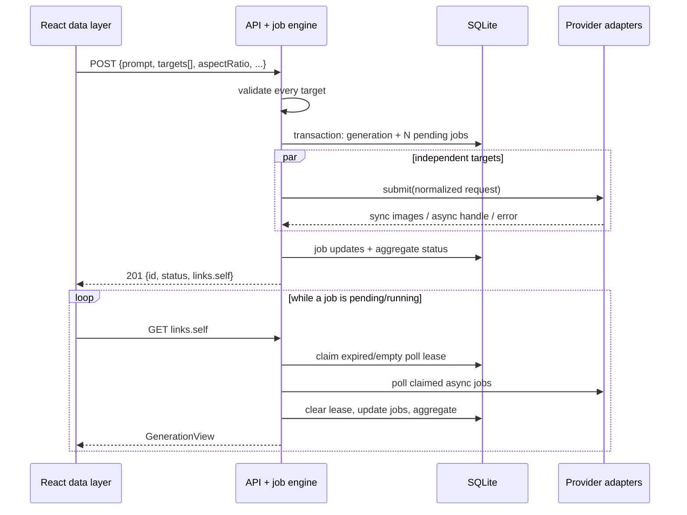

# 优化方案与改动面

## 1. 方案总览

保留现有 Next.js + SQLite 模块化单体。POST 先校验每个 target，随后在同一事务中创建一条 generation 与 N 条 jobs；提交在事务后对各 target 独立执行。同步结果立即转存，异步结果由 GET 通过短期 `pollLeaseUntil` 推进。React 只通过公开 API DTO 完成能力推导与轮询，不接触 Provider 或密钥。



## 2. 设计决策

| 决策 | 选择 | 理由 | 放弃与代价 |
|---|---|---|---|
| 扇出持久化 | 一 generation + 一 target 一 job 的单事务写入 | generation 与完整 target 集不可分割；符合现有 schema | 需新增多 job query helper |
| 轮询排他 | `pollLeaseUntil`（实施为 120 秒）独立字段 | 保留真实 `pending/running` 状态，覆盖 status/response/图片转存完整路径，崩溃后可恢复 | lease 到期前最多延迟一次 poll；不提供后台自动推进 |
| 同步 target | 同一 POST 中 `Promise.all` 独立提交 | 一条慢 sync target 不应串行放大其他 target 延迟 | 本地 MVP 无并发背压；将来有真实压力再引入受限 worker |
| 公共参数 | 服务端逐 target 校验/归一化 | 防止前端能力缓存过期或被绕过 | 所有 target 必须共享可选的 negativePrompt；seed 为按 target 省略 |
| Fal 比例 | adapter 内部比例→Fal size 映射 | 避免公共 API 透出 `square_hd` 等厂商枚举 | 当前 Fal + ZenMux 的共同公开比仅 `1:1` |
| 前端边界 | 无 UI 的纯 API data layer | 完整支持演示图操作流，又不提前锁死视觉结构 | 页面实现需要后续消费这些模块 |
| 兼容 | 不接收旧顶层 `provider/model` | 目标契约明确且没有外部消费者证据 | 已有本地调用方需迁移为 `targets[]` |

## 3. 分阶段实施

### Phase 1：数据模型与 provider 公共语义

修改 `src/lib/db/schema.ts`，为 `generation_jobs` 增加可空 `pollLeaseUntil`；修改 `src/lib/db/queries/generations.ts`：

- 新增 `createGenerationWithJobs()`，在一个 transaction 插入 generation 与全部 jobs；保留 `createGenerationAndJob()` 作为内部单 job 测试/调用便利包装。
- 新增原子 `tryClaimPollLease(jobId, now, leaseUntil)`：仅在 status 为 pending/running 且租约为空或已过期时成功。
- 所有 job update 能明确写入或清除租约；聚合优先级调整为 running → pending → 任意 completed → cancelled → failed。
- 将 Fal capabilities 声明为 `1:1`、`4:3`、`3:4`、`16:9`、`9:16`，在 `adapters/fal.ts` 映射为厂商 size 枚举。

完成定义：多 job 原子写入、过期 lease 可重新 claim、租约不会改写真实 status、Fal 请求的 `image_size` 与公开比例一致。

### Phase 2：任务引擎与 API 契约

修改 `src/lib/job-engine/types.ts`、`validator.ts`、`orchestrator.ts`、`lifecycle.ts` 与 API contract tests：

- `SubmitGenerationParams` 改用 `targets[]`，拒绝空数组、未知 target、重复 `(provider, model)`、不支持的 mode/count/比例和无效 session。
- 对每个 target 构造新的 `NormalizedRequest`；对不支持 seed 的 target 不包含 seed。negativePrompt 有值时要求全部 target 支持。
- POST 在 transaction 后并行执行每条 job，分别记录 sync images、async handle 或 error；不要让一个 target 的失败中断其他 target。
- `advance()` 以租约 claim 代替 status 锁，解析/轮询后在同一 job 更新中清理 lease；GET 并行推进所有可轮询 job。
- POST 只接受 `targets[]`；GenerationView 持续返回按 job 分类的状态、错误和图片。

完成定义：Fal + ZenMux 同时提交时分别有两条 job；Fal 可持续从 pending/running 轮询到完成；ZenMux 的不支持 seed 不会使整单 400；任一 job 成功、另一 job 失败时 generation 为 completed。

### Phase 3：React API 数据层（无 UI）

新增 `src/lib/web-client/`（或项目既有等价客户端目录）：

- `types.ts`：公开 API DTO，不从 server job-engine 类型反向导入。
- `api-client.ts`：`listProviders`、`submitGeneration`、`getGeneration`，统一解析 HTTP 错误。
- `capabilities.ts`：将模型平铺为可选 target，计算公共 `aspectRatio`、count 上限、seed 可见性、negativePrompt 可用性，并构造 `targets[]` 请求；只保留当前公开字段。
- `polling.ts`：可取消的控制器，使用 `links.self`、2→5 秒退避，在所有 job 终态时停止；不包含 React component 或 UI side effect。

完成定义：纯函数可由单元测试覆盖；调用方无需知道 Provider endpoint、密钥或内部 adapter 名称即可支撑演示图的选择/提交/进度数据。

### Phase 4：文档、验证与交接

同步修订 `docs/mvp/api/constraints.md`、`docs/mvp/db/data-model.md`、`docs/mvp/job-engine/{architecture,dfd-interface,test}.md` 的 lease 语义；更新 `.env.example` 的注释或非机密配置名，但不写入值。执行 04 所列命令，保留后续五家 Provider 的接入批次说明。

## 4. 按目录改动面

| 路径 | 动作 | 说明 |
|---|---|---|
| `src/lib/db/schema.ts` | 修改 | 增加 `pollLeaseUntil` |
| `src/lib/db/queries/generations.ts` | 修改 | N job transaction、lease claim、聚合 |
| `src/lib/providers/capabilities/fal.ts` | 修改 | 公开比例 |
| `src/lib/providers/adapters/fal.ts` | 修改 | 公开比例→Fal size |
| `src/lib/job-engine/*` | 修改 | targets 校验、扇出、lease 生命周期 |
| `src/app/api/generations/*` | 修改 | 新 DTO 契约接线 |
| `src/lib/web-client/*` | 新增 | React 无 UI API 数据层 |
| `tests/` 与 `*.test.ts` | 修改/新增 | 见 04 |
| `docs/mvp/**`、本目录 | 修改/新增 | 契约与交接 |

## 5. API、迁移与配置

POST 请求唯一形状：

```json
{
  "prompt": "A reading nook",
  "targets": [
    { "provider": "fal", "model": "fal-ai/flux/schnell" },
    { "provider": "zenmux", "model": "openai/gpt-image-2" }
  ],
  "aspectRatio": "1:1",
  "count": 1,
  "seed": 123456789
}
```

配置只通过 `.env`：现有 `FAL_KEY` 与 `ZENMUX_API_KEY` 保持；后续继续使用 `SILICONFLOW_API_KEY`、`ZHIPU_API_KEY`、`ARK_API_KEY`、`DASHSCOPE_API_KEY`、`KLING_API_KEY`，并为 Qwen 明确 `DASHSCOPE_BASE_URL=https://dashscope.aliyuncs.com/api/v1`（北京）。真实值不提交，前端代码不读取这些变量。

SQLite 本地开发使用 schema push/迁移流程新增列；已有开发数据库需在实现前执行现有 DB 更新脚本。当前没有已发布外部 API 或生产数据迁移承诺，因此不提供旧 JSON shim。

## 6. 风险与回滚

| 风险 | 防护 | 回滚 |
|---|---|---|
| 租约过短导致重复 poll | 120 秒覆盖 Fal 双请求与图片转存预算；原子条件写入 | 增加租约常量，不改 status 语义 |
| Provider 失败掩盖其他结果 | 每 target 独立 catch 与 job error | 单 job 仍可标 failed，聚合保持部分成功 |
| API 破坏影响本地调用 | contract、quickstart、React client 同步改为 targets | 恢复旧版本仅限开发环境；不引入双契约长期负担 |
| Fal 比例映射错误 | adapter 请求体 unit tests | 只回退 Fal mapping，不影响数据模型 |
| UI 需求混入数据层 | 客户端目录禁止 component/style import | 移除纯客户端模块即可，不影响 API |

## 7. 与 00 的边界对齐

本计划实现 Fal + ZenMux 文生图、独立租约和 React 无 UI 接线；没有新增五家 Provider、UI/CSS、队列、认证或高级生成模式。所有密钥仍局限于 `.env` 服务端环境。
